# Diagram architektury UI - Moduł Autentykacji

## Przegląd

Ten diagram przedstawia architekturę UI dla systemu autentykacji 10x-cards, uwzględniając zarówno nowe komponenty autentykacji, jak i istniejące komponenty generowania fiszek.

## Diagram

```mermaid
graph TD
    MW[Middleware index.ts]
    ENVD[env.d.ts Types]
    SBC[supabase-browser.ts]
    SBS[supabase.client.ts]
    
    AuthHelpers[auth-helpers.ts]
    AuthErrors[auth-errors.ts]
    AuthSchemas[auth.schemas.ts]
    
    AuthLayout[AuthLayout.astro]
    AppLayout[Layout.astro]
    
    LoginPage[login.astro]
    RegisterPage[register.astro]
    ForgotPage[forgot-password.astro]
    ResetPage[reset-password.astro]
    ConfirmPage[confirm.astro]
    
    LoginForm[LoginForm.tsx]
    RegisterForm[RegisterForm.tsx]
    ForgotForm[ForgotPasswordForm.tsx]
    ResetForm[ResetPasswordForm.tsx]
    NavBar[NavigationBar.tsx]
    
    IndexPage[index.astro]
    GeneratePage[generate.astro]
    
    GenContainer[GenerateViewContainer.tsx]
    SourceInput[SourceTextInput.tsx]
    GenButton[GenerateButton.tsx]
    ProposalList[ProposalsList.tsx]
    ProposalCard[ProposalCard.tsx]
    SaveButton[BatchSaveButton.tsx]
    
    UseGenerate[useGenerateFlashcards.ts]
    
    FlashcardsAPI[api/flashcards]
    GenerationsAPI[api/generations]
    
    FlashcardService[flashcard.service.ts]
    GenerationService[generation.service.ts]
    OpenRouterService[openrouter.service.ts]
    
    RLS[Row Level Security]
    Tables[Tabele flashcards i generations]
    
    MW --> ENVD
    SBS --> MW
    MW --> IndexPage
    MW --> GeneratePage
    MW --> LoginPage
    
    LoginPage --> AuthLayout
    RegisterPage --> AuthLayout
    ForgotPage --> AuthLayout
    ResetPage --> AuthLayout
    ConfirmPage --> AuthLayout
    
    LoginPage --> LoginForm
    RegisterPage --> RegisterForm
    ForgotPage --> ForgotForm
    ResetPage --> ResetForm
    
    LoginForm --> SBC
    RegisterForm --> SBC
    ForgotForm --> SBC
    ResetForm --> SBC
    NavBar --> SBC
    
    AuthHelpers --> LoginPage
    AuthErrors --> LoginForm
    AuthSchemas --> LoginForm
    AuthSchemas --> RegisterForm
    
    IndexPage --> ENVD
    IndexPage --> LoginPage
    IndexPage --> GeneratePage
    
    GeneratePage --> ENVD
    GeneratePage --> AppLayout
    GeneratePage --> NavBar
    GeneratePage --> GenContainer
    
    GenContainer --> SourceInput
    GenContainer --> GenButton
    GenContainer --> ProposalList
    GenContainer --> SaveButton
    GenContainer --> UseGenerate
    ProposalList --> ProposalCard
    
    UseGenerate --> FlashcardsAPI
    UseGenerate --> GenerationsAPI
    
    FlashcardsAPI --> ENVD
    GenerationsAPI --> ENVD
    
    FlashcardsAPI --> FlashcardService
    GenerationsAPI --> GenerationService
    
    GenerationService --> OpenRouterService
    
    FlashcardService --> Tables
    GenerationService --> Tables
    Tables --> RLS
    
    classDef new fill:#10b981,stroke:#059669,stroke-width:3px,color:#fff
    classDef updated fill:#f59e0b,stroke:#d97706,stroke-width:3px,color:#fff
    classDef existing fill:#6366f1,stroke:#4f46e5,stroke-width:2px,color:#fff
    classDef util fill:#14b8a6,stroke:#0d9488,stroke-width:2px,color:#fff
    
    class LoginPage,RegisterPage,ForgotPage,ResetPage,ConfirmPage,LoginForm,RegisterForm,ForgotForm,ResetForm,NavBar,AuthLayout new
    class IndexPage,GeneratePage,FlashcardsAPI,GenerationsAPI,FlashcardService,GenerationService updated
    class GenContainer,SourceInput,GenButton,ProposalList,ProposalCard,SaveButton,UseGenerate,OpenRouterService existing
    class AuthHelpers,AuthErrors,AuthSchemas,SBC,SBS,AppLayout util
```



## Legenda

- **🆕 Zielony (new)** - Nowe komponenty i strony dodane dla systemu autentykacji
- **🔄 Pomarańczowy (updated)** - Istniejące komponenty wymagające aktualizacji
- **Niebieski (existing)** - Istniejące komponenty bez zmian
- **Fioletowy (layout)** - Layouty Astro
- **Turkusowy (util)** - Utility i pomocnicze funkcje
- **Różowy (api)** - Endpointy API

## Kluczowe przepływy

### 1. Rejestracja użytkownika
```
User → RegisterPage → RegisterForm → supabase-browser → Supabase Auth
→ Email wysłany → ConfirmPage → redirect do LoginPage
```

### 2. Logowanie
```
User → LoginPage → LoginForm → supabase-browser → Supabase Auth
→ Session utworzona → redirect do GeneratePage → sprawdzenie przez Middleware
```

### 3. Generowanie fiszek (chronione)
```
User → GeneratePage → sprawdzenie session przez Middleware
→ NavBar (wyświetla użytkownika) + GenerateViewContainer
→ useGenerateFlashcards → API endpoints → Services (z userId)
→ Supabase (RLS wymusza dostęp tylko do własnych danych)
```

### 4. Wylogowanie
```
User → NavBar → signOut() → Supabase Auth → clear cookies
→ redirect do LoginPage
```

### 5. Resetowanie hasła
```
User → ForgotPage → ForgotForm → resetPasswordForEmail
→ Email wysłany → ResetPage → ResetForm → updateUser
→ redirect do LoginPage
```

## Bezpieczeństwo

- **Middleware**: Sprawdza sesję dla wszystkich żądań, zapisuje w `Astro.locals`
- **SSR Protection**: Strony chronione sprawdzają `Astro.locals.session` przed renderowaniem
- **API Protection**: Endpointy API sprawdzają `locals.session` przed przetworzeniem
- **RLS**: Row Level Security w Supabase wymusza izolację danych na poziomie bazy danych
- **Cookie Security**: httpOnly cookies, SameSite, HTTPS w produkcji
- **Token Management**: Automatyczne odświeżanie tokenów przez Supabase SDK

## Struktura katalogów

```
src/
├── pages/
│   ├── auth/                    [🆕 Nowy katalog]
│   │   ├── login.astro         [🆕]
│   │   ├── register.astro      [🆕]
│   │   ├── forgot-password.astro [🆕]
│   │   ├── reset-password.astro [🆕]
│   │   └── confirm.astro       [🆕]
│   ├── index.astro              [🔄 Aktualizacja]
│   └── generate.astro           [🔄 Aktualizacja]
├── layouts/
│   ├── Layout.astro             [Istniejący]
│   └── AuthLayout.astro         [🆕]
├── components/
│   ├── auth/                    [🆕 Nowy katalog]
│   │   ├── LoginForm.tsx       [🆕]
│   │   ├── RegisterForm.tsx    [🆕]
│   │   ├── ForgotPasswordForm.tsx [🆕]
│   │   └── ResetPasswordForm.tsx [🆕]
│   ├── layout/                  [🆕 Nowy katalog]
│   │   └── NavigationBar.tsx   [🆕]
│   └── generate/                [Istniejące]
├── lib/
│   ├── utils/
│   │   ├── supabase-browser.ts [🆕]
│   │   ├── auth-helpers.ts     [🆕]
│   │   └── auth-errors.ts      [🆕]
│   ├── validation/
│   │   └── auth.schemas.ts     [🆕]
│   └── services/
│       ├── flashcard.service.ts [🔄 Aktualizacja - userId param]
│       └── generation.service.ts [🔄 Aktualizacja - userId param]
├── middleware/
│   └── index.ts                 [🔄 Aktualizacja - session management]
└── env.d.ts                     [🔄 Aktualizacja - typy]
```

